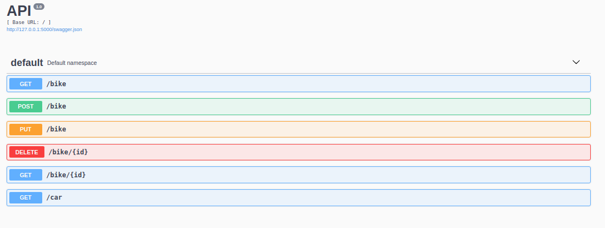
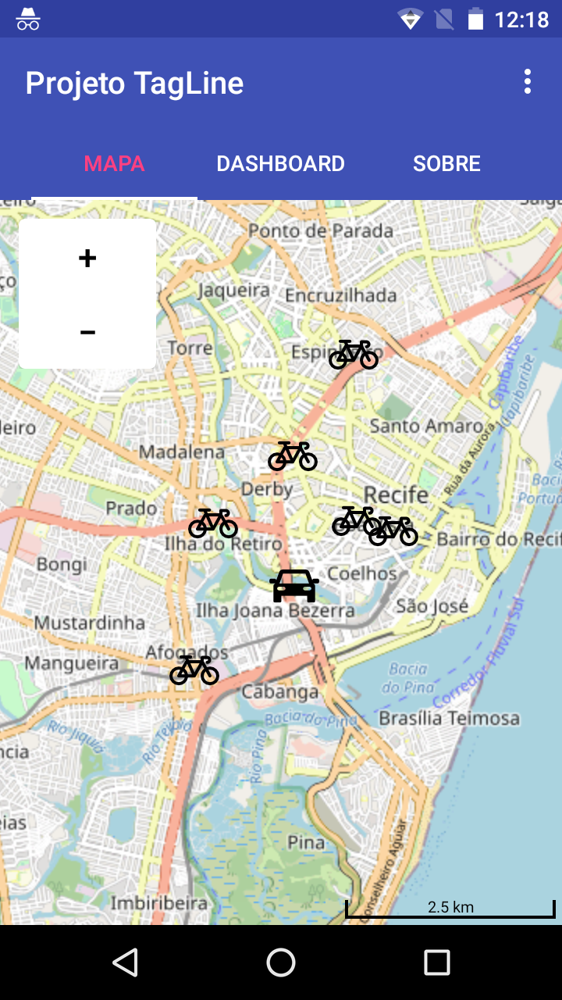
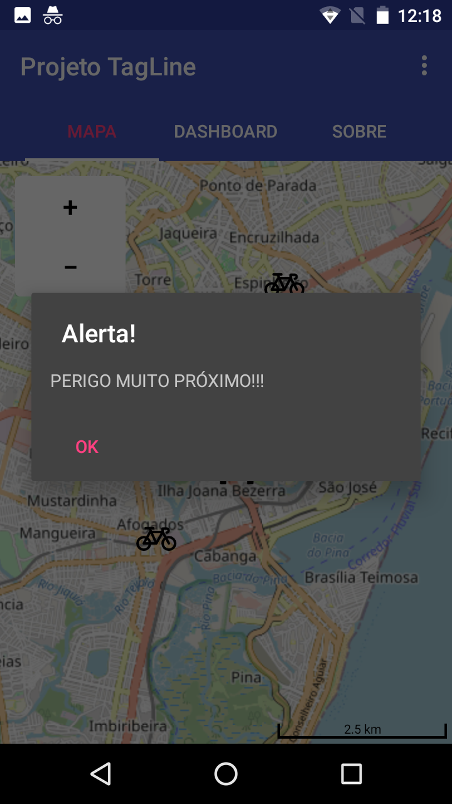
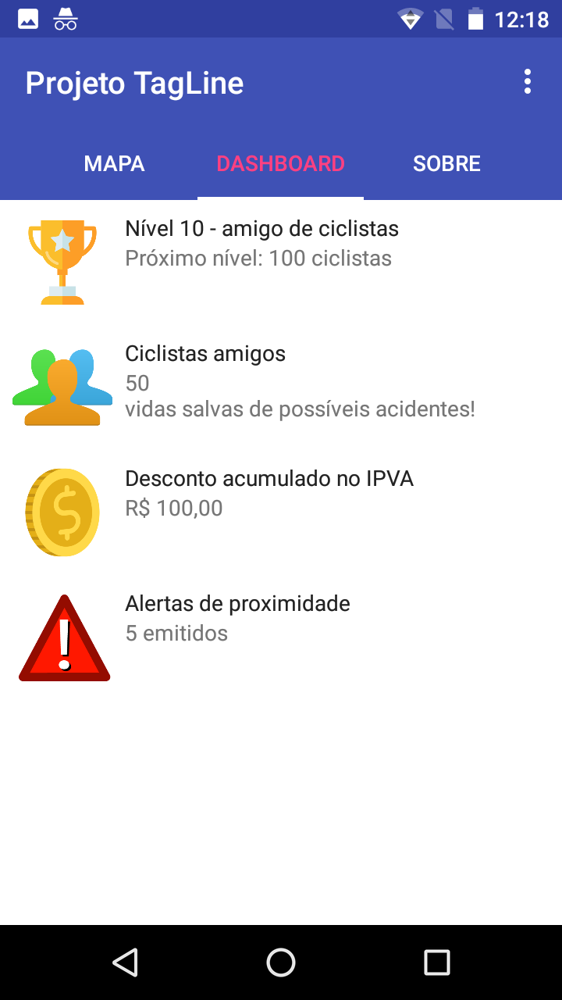
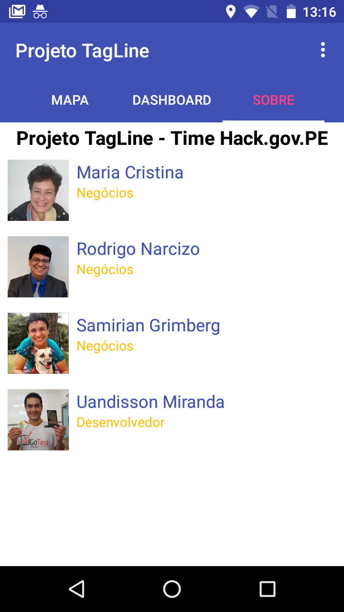

# Projeto-TagLine-HACK_GOV_PE

# Backend Python

## Requirements
- Flask 1.1.2

to clone the repository
```
$ git clone https://github.com/uandisson/Projeto-TagLine-HACK_GOV_PE.git
```
```
$ cd Projeto-TagLine-HACK_GOV_PE/backend
```
```
$ python3 server.py
```

if all is well, in the terminal: http://127.0.0.1:5000/



## Structure

Endpoint |HTTP Method | CRUD Method | Result
-- | -- |-- |--
`bike` | GET | READ | Get all bikes
`bike/:id` | GET | READ | Get a single bike
`bike`| POST | CREATE | Create a new bike
`bike/:id` | PUT | UPDATE | Update a bike
`bike/:id` | DELETE | DELETE | Delete a bike
`car` | GET | READ | Get all car

# Frontend











# Use

install .apk or execute this source code in the Android Studio
